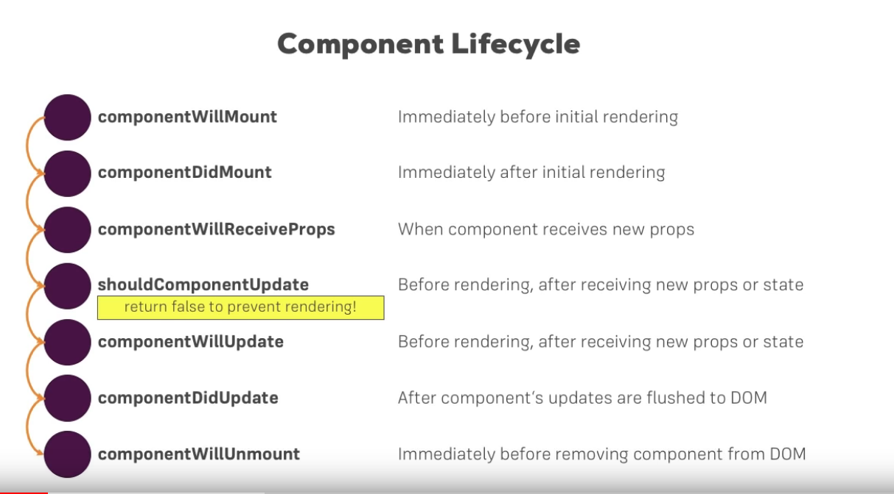

# The Component Lifecycle

Each component has several “lifecycle methods” that you can override to run code at particular times in the process. You can use this lifecycle diagram as a cheat sheet. In the list below, commonly used lifecycle methods are marked as bold. The rest of them exist for relatively rare use cases

- **Mounting**

- constructor()
- static getDerivedStateFromProps()
- render()
- componentDidMount()

- **Updating**
An update can be caused by changes to props or state. These methods are called in the following order when a component is being re-rendered:

- static getDerivedStateFromProps()
- shouldComponentUpdate()
- render()
- getSnapshotBeforeUpdate()
- componentDidUpdate()

- **Unmounting**

This method is called when a component is being removed from the DOM:

- componentWillUnmount()

## Composition vs Inheritance

- **Composition**

Composition is also a familiar concept in Object Oriented Programming. Instead of inheriting properties from a base class, it describes a class that can reference one or more objects of another class as instances.

Example: A car has an engine can be modeled with composition.

## terms

- component props : stands for properties and is being used for passing data from one component to another.

- component state : The state object is where you store property values that belongs to the component. When the state object changes, the component re-renders.

- application state : the state at which an application resides with regards to where in a program is being executed and the memory that is stored for the application.
